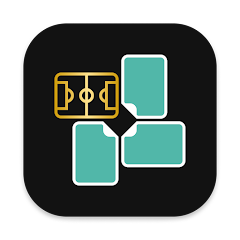

# Privacy Policy

  

This privacy policy applies to the Album 2026 app (hereby referred to as "Application") for mobile devices that was created by elreis (hereby referred to as "Service Provider") as a Freemium service. This service is intended for use "AS IS".

---

## Information Collection and Use

The Application collects information when you download and use it. This information may include information such as:

- Your device's Internet Protocol address (e.g. IP address)
- The pages of the Application that you visit, the time and date of your visit, the time spent on those pages
- The time spent on the Application
- The operating system you use on your mobile device

The Application does not gather precise information about the location of your mobile device.

The Application does not use Artificial Intelligence (AI) technologies to process your data or provide features.

The Service Provider may use the information you provided to contact you from time to time to provide you with important information, required notices and marketing promotions.

For a better experience, while using the Application, the Service Provider may require you to provide certain personally identifiable information, including but not limited to Email. The information requested will be retained and used as described in this privacy policy.

---

## Third Party Access

Only aggregated, anonymized data is periodically transmitted to external services to aid the Service Provider in improving the Application and their service.

The Service Provider may share your information with third parties in the ways described in this privacy statement.

The Service Provider may disclose User Provided and Automatically Collected Information:

- as required by law, such as to comply with a subpoena or similar legal process;
- when they believe in good faith that disclosure is necessary to protect their rights, protect your safety or the safety of others, investigate fraud, or respond to a government request;
- with trusted service providers who work on their behalf, do not have independent use of the information disclosed to them, and have agreed to adhere to the rules set forth in this privacy statement.

---

## Opt-Out Rights

You can stop all collection of information by the Application easily by uninstalling it.

You may use the standard uninstall processes available as part of your mobile device or via the mobile application marketplace or network.

---

## Data Retention Policy

The Service Provider will retain User Provided data for as long as you use the Application and for a reasonable time thereafter.

If you would like your User Provided Data deleted, please contact:

**elreis13@gmail.com**

The request will be handled within a reasonable time.

---

## Children

The Service Provider does not knowingly collect personally identifiable information from children under the age of 13.

The Application is not directed to children under 13 years old.

Parents and legal guardians are encouraged to monitor their children's internet usage and help enforce this Policy by instructing children never to provide personally identifiable information without permission.

If you believe a child has provided personal information through the Application, please contact:

**elreis13@gmail.com**

Necessary actions will be taken promptly.

You must also be at least 16 years old to consent to the processing of your personal information in your country (or have parental/guardian consent where applicable).

---

## Security

The Service Provider is concerned about safeguarding the confidentiality of your information.

Reasonable physical, electronic, and procedural safeguards are implemented to protect information processed and maintained by the Application.

---

## Changes to This Privacy Policy

This Privacy Policy may be updated from time to time for any reason.

The Service Provider will notify users of any changes by updating this page.

You are advised to review this Privacy Policy periodically for any changes. Continued use of the Application is deemed acceptance of all modifications.

---

## Effective Date

This privacy policy is effective as of **2026-05-14**

---

## Your Consent

By using the Application, you consent to the processing of your information as set forth in this Privacy Policy now and as amended in the future.

---

## Contact Us

If you have any questions regarding privacy while using the Application, or have questions about the practices, please contact:

**elreis13@gmail.com**
